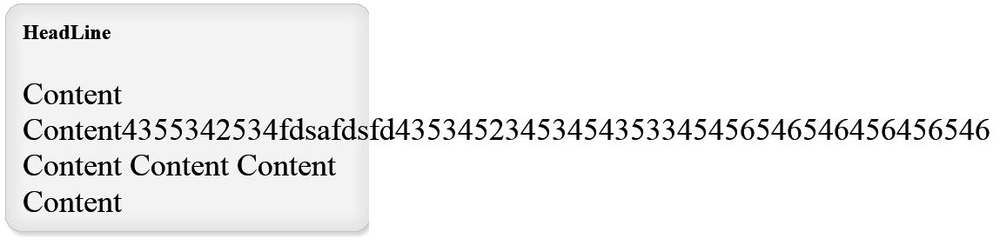

* content
{:toc}

这里记录解决连续英文字母超出div宽度限制问题的过程。

---

## 起因 

今天在家练习CSS时，发现连续英文字母会超出div宽度限制，如图,div宽度与背景图片宽度相等，但内容超出div边界:

## 找到原因

原因：连续英文字母、数字在div、p、h1、h2、、、中不自动换行

## 解决方案

尝试1：使用word-wrap:break-word，将其强制换行  

结果：换行成功，连续英文字母受div宽度限制，不再超出div.
